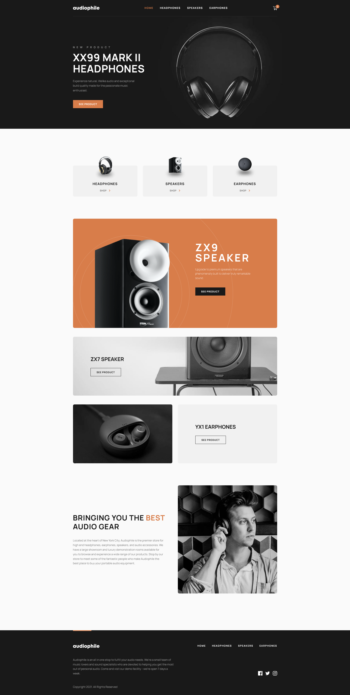

# Audiophile | E-commerce

E-commerce website for those who are enthusiastic about high-fidelity sound reproduction.

This is a solution to the [Audiophile E-commerce website challenge on Frontend Mentor](https://www.frontendmentor.io/challenges/audiophile-ecommerce-website-C8cuSd_wx). Frontend Mentor challenges help you improve your coding skills by building realistic projects.

## Table of contents

- [Overview](#overview)
  - [The Challenge](#the-challenge)
  - [Screenshot](#screenshot)
  - [Links](#links)
  - [Setup](#setup)
- [My Process](#my-process)
  - [Built with](#built-with)
  - [What I learned](#what-i-learned)
  - [Continued development](#continued-development)

## Overview

### The Challenge

Users should be able to:

- View the optimal layout for the app depending on their device's screen size :heavy_check_mark:
- See hover states for all interactive elements on the page :heavy_check_mark:
- Add/Remove products from the cart :heavy_check_mark:
- Edit product quantities in the cart :heavy_check_mark:
- Fill in all fields in the checkout :heavy_check_mark:
- Receive form validations if fields are missed or incorrect during checkout :heavy_check_mark:
- See correct checkout totals depending on the products in the cart :heavy_check_mark:
  - Shipping always adds $50 to the order :heavy_check_mark:
  - VAT is calculated as 20% of the product total, excluding shipping :heavy_check_mark:
- See an order confirmation modal after checking out with an order summary :heavy_check_mark:
- **Bonus**: Keep track of what's in the cart, even after refreshing the browser (`localStorage` could be used for this if you're not building out a full-stack app) :heavy_check_mark:

### Screenshot



### Links

[Live Site URL](https://audiophile-teal.vercel.app/)

### Setup

To run this project locally:

```
yarn && yarn dev
```

or

```
npm install && npm run dev
```

## My process

### Built with

- TypeScript
- Next.js
- Redux Toolkit
- React-Hook-Form
- Tailwind CSS
- Figma Designs
- Mobile-first workflow

### What I learned

#### TypeScript

I have recently embarked on a journey to learn TypeScript as it seems to be a must-have skill for most modern Front end development jobs. Given my solid foundation in JavaScript, my main challenge with TypeScript has been adapting to static typing, understanding type inference, mastering the syntax, and delving into more advanced features.

I was able to expand my knowledge of the following topics:

- Type Definitions and Interfaces
- Type Annotations and Inference
- Union Types
- Types related to events (HTMLInputElement, HTMLButtonElement, React.MouseEvent, React.KeyboardEvent)
- Types related to Redux Toolkit (RootState, PayloadAction)
- Tooling/Build Config (eslint/tsconfig.json)

#### Next.js

Next is another one of those things that I have been meaning to explore a bit more as well since it seems to be so popular right now. Using it for this project seemed like overkill considering I chose to build it out as a Front end app only without using some of the features Next seems to be most known for. I think in the future, if I wanted an additional challenge, I could refactor this using Vercel's serverless functions along with a managed database like Vercel Postgres to turn this into more of a Full-stack application without maintaining a separate backend server. This would ultimately help me get a better sense of how this functionality works under the hood as it seems to be a common design pattern with Next apps.

#### Redux Toolkit

Redux is one of the oldest and most popular state management libraries for React applications, and although currently there are [many alternatives](https://leerob.io/blog/react-state-management) to choose from, in job listings for React positions you will see Redux more often than others.

Redux Toolkit is a library that makes working with Redux a lot easier, as it eliminates a lot of boilerplate. With Redux Toolkit you can create so called slices (pieces of state in your application) that combine action creators and reducers. It automatically sets up Redux DevTools by default.

It also allows you to update state in a 'mutating way' thanks to Immer library it uses under the hood.

In the application I'm using Redux to manage the cart state, persist it to local storage and retrieve it when the app is loaded.

#### TailwindCSS

I had the documentation pulled up almost 100% of the time while I was working to reference the correct classNames in order to achieve the desired styles. I also learned a bit more about how to properly set up the tailwind config file so that I could customize the default theme for the project. This made tasks like establishing my color palette and app breakpoints super easy, and allowed me to plug in alot of the info provided by the design spec to ensure I was sticking to the requirements.

```
import type { Config } from 'tailwindcss';

const config: Config = {
  content: [
    './app/**/*.{js,ts,jsx,tsx,mdx}',
    './components/**/*.{js,ts,jsx,tsx,mdx}',
    './pages/**/*.{js,ts,jsx,tsx,mdx}',
  ],
  theme: {
    colors: {
      primary: '#D87D4A',
      secondary: '#FBAF85',
      error: '#CD2C2C',
      black: {
        primary: '#000000',
        secondary: '#101010',
        tertiary: '#1C1C1C',
      },
      white: {
        primary: '#FFFFFF',
        secondary: '#F1F1F1',
        tertiary: '#FAFAFA',
      },
    },
    extend: {
      animation: {
        'open-menu': 'open-menu 0.3s ease-in-out forwards',
      },
      keyframes: {
        'open-menu': {
          '0%': { transform: 'scaleX(0)' },
          '100%': { transform: 'scaleX(1)' },
        },
      },
      spacing: {},
    },
    screens: {
      'xs': '0px',
      'sm': '480px',
      'md': '768px',
      'lg': '1024px',
      'xl': '1280px',
      '2xl': '1440px',
      '3xl': '1536px',
      '4xl': '1920px',
    },
  },
  plugins: [require('tailwind-scrollbar')],
};

export default config;
```

### Continued development

Create unit and integration tests with Jest/React-Testing-Library.
